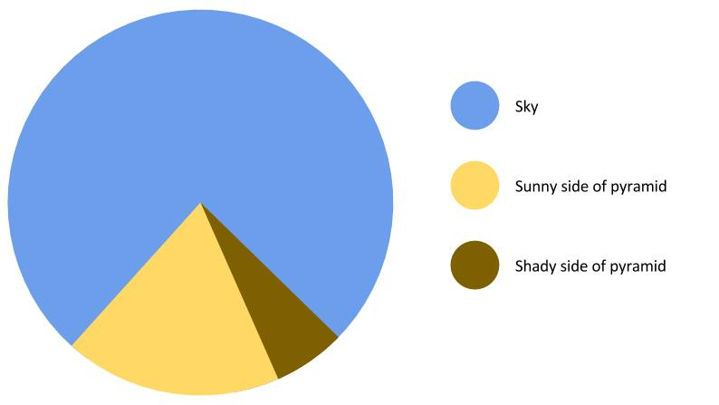

# portfolio.
---
> Public portfolio for Telling Stories with Data, Spring 2023 at Carnegie Mellon University.   

  
[Source](https://percentagecalculator.mes.fm/memes/the-great-pyramid-of-giza-pie-chart)  

# about me.
---
**Name:** Akanksha Sahay  
**Pronouns:** She/her/hers  
**Program:** Master of Entertainment Industry Management   
**Education:** B.A. Communication & Media Studies, University of Michigan  
**Hobbies:** Watching Film/TV, Reading, Dancing, Food  

# learning objectives.
---
- Guiding audience attention/eyes through visualization
- Infographics organization
- Font selection/color selection
- Improved designer's eye
- Articulating critiques to achieve the changes I want to see

# projects.
---
| `examples` | `assignments` | `final` |  
| :-: | :-: | :-: |  
| - | 💰 Visualizing Government Debt | ☑️ Part One |  
| - | 📋 Critique By Design | ☑️ Part Two |  
| - | - | ☑️ Part Three |  
