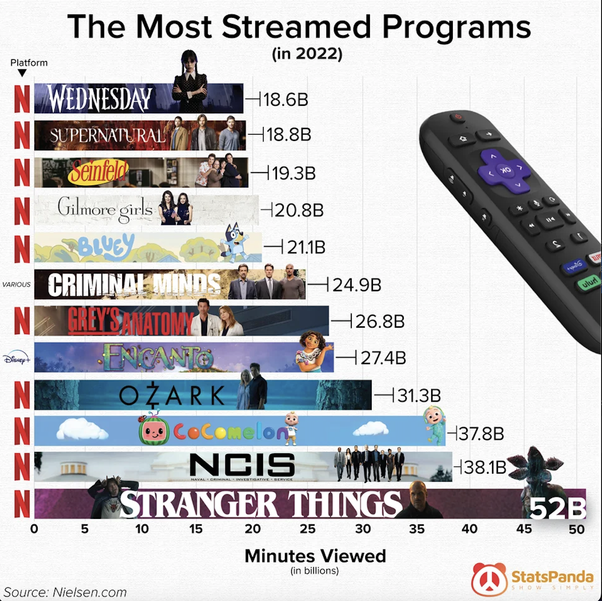

# assignment 3: 📋 Critique By Design
---
# step 1: The Original Data Visualization

[Source](https://www.reddit.com/r/dataisbeautiful/comments/10u0etq/oc_the_most_streamed_programs/)
---
# step 2: The Critique

| - | Usefulness | Completeness | Perceptibility | Truthfulness | Intuitiveness | Aesthetics | Engagement |
| --- | --- | --- | --- | --- | --- | --- | --- | 
| Rating | 5 | 8 | 3 | 3 | 4 | 3 | 5 |

---

