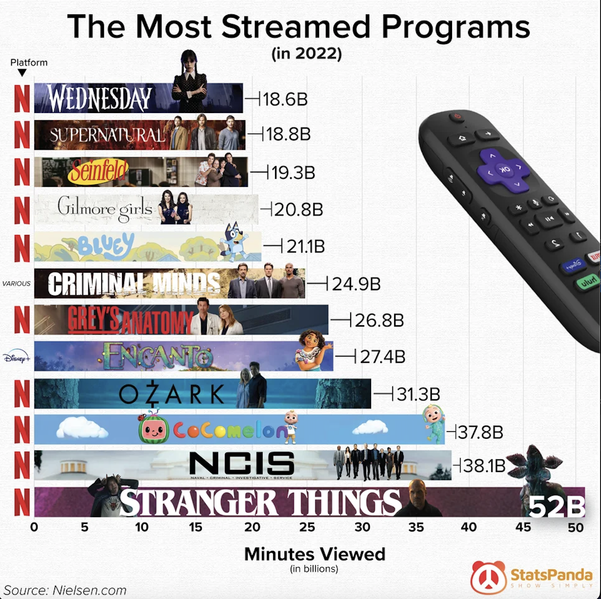

# assignment 3: 📋 Critique By Design
---
# step 1: The Original Data Visualization

[Source](https://www.reddit.com/r/dataisbeautiful/comments/10u0etq/oc_the_most_streamed_programs/)

---
# step 2: The Critique

| - | Usefulness | Completeness | Perceptibility | Truthfulness | Intuitiveness | Aesthetics | Engagement |
| --- | --- | --- | --- | --- | --- | --- | --- | 
| Rating | 5 | 8 | 3 | 3 | 4 | 3 | 5 |

The first thing that stood out to me was the busy-ness of the image. Aesthetically, the visualization is displeasing. The title, the platform logos, the show title designs in each cart, and data points are all competing for the eye's attention. Most of all, the eye is drawn to an oversized TV remote that is horizontally mirrored resulting in backwards text which is also confusing. While there is a lot of data, it is too much and does not show a clear narrative for the audience. Much of the information is redundant, repeated in many different ways. Also some of the text formatting is inconsistent, creating a disruptive visual vocabulary. I would decide what message I want to tell with the information and use that to inform the visualization. This would include updating the title, reducing the amount of information, images and colors overall, and drawing more attention to the platforms the most streamed shows appear on.

Since the visualization was found on Data Is Beautiful Subreddit, the audience is people who enjoy data visualizations. The audience may also be people curious about the best streaming programs. The data visualization is somewhat effective communicating which programs had the most minutes of viewing and which platforms those shows can be found on. However, it takes some viewing to understand all the data - there is an overwhelming amount of information, due to repetition, excessive use of color and images, and incomplete titles. It also isn't totally clear if the data visualization aims to promote the programs or the platforms. The column showing the platforms with the recognizable logos is competing for attention with the show title cards in each bar.

This method was useful for considering not just the visual elements but the larger information and insight the audience is meant to gain from the visualization. I may include some measures to help diagnose common issues in visualizations like redundancy.  The measures generally cover in one category or another key qualities of a good visualization - time to understanding could be considered in usefulness, intuitiveness and perceptibility. 

For this visualization, I would first switch the chart from horizontal bars to vertical, to show the magnitude of the largest streaming program. Second, I would remove the remote image and the program promo images in the bars to reduce clutter and improve aesthetics.

---
# step 3: The Sketch

I implemented my initial recommendations first. I turned the chart vertical to better show the high value of Stranger Things. In addition I removed the platform logos and additional imagery. I still captured the platforms with logos and reducing the bar chart colors to match the logos. This started to show a greater story about how Netflix programs occupy most of the top 15 most streamed programs. I still kept the numnbers showing the minutes viewed for each record, but I did reduce the tic marks on the axis. I also captured the program names in the vertical bars. 

---
# step 4: The Test

| User | Feedback |
| --- | --- |
| student, mid-20s | This looks like a chart on most streamed programs. I'm not sure what year, but I think it's based on the length of the show. This tells me Netflix has long shows, but I'm confused if it means minutes in the show or how much streamed. I can't tell who the audience is. I need labels or something to explain the difference in color. Why is there so much red? |
| student, mid-20s | This looks like the most streamed programs in 2022 based on minutes watched across streaming platforms. Netflix was the most watched platform, probably because little kids drove their parents insane by putting Encanto on repeat all day. I'm a little confused by the black bar for Criminal Minds and I can't tell what its label says at the bottom. The intended audience is probably people interested in the streaming market. It would help to specify if it's a TV show or Movie. I also need more clarification what Minutes means. I love the colors and cute symbols at the bottom though. |
|  elementary school teacher, mid-20s | This looks like the most streamed programs in minutes. Almost all of these programs are on netflix. I'd think this is for people looking to make new programs and see what's popular. |

The key issues I identified were:
- The message was sort of getting communicated that Netflix had the most streamed programs, but I needed to be clearer.
- What the minutes were measuring was unclear to audiences and needed more explanation.
- It may not be clear that the colors of the bars match the logos of the companies.  

While it was not mentioned in feedback, I also know that I was not able to scale the bars correctly to show that Stranger Things had over twice the amount of viewing time compared to Criminal Minds.

---
# step 5: The Solution

**Attempt 1: Flourish**

My first attempt at a solution was built in Flourish because I felt more comfortable with the interface. Taking the feedback into account, I decided not to use logos in the graphic, and even removed unnecessary grid lines to clear up clutter. I moved the program labels to the bottom to make them easier to read. I also updated the title to more clearly communicate the story of the visualization, and used the subtitle to explain the measure of minutes more clearly. Finally, I made the data values horizontally aligned to make them easier to read. 

Unfortunately, I could not create a legend with the data organized by program, as each program received its own label. That created too much visual clutter, so instead I used a filter that showed which bars/programs came from which streaming service. It was not an ideal solution, but worked with the limitaitons of Flourish. Flourish did allow me to add some more information to the pop-ups, like the number of episodes per program for more curious audiences who wonder how program length affects total minutes viewed. 

In class, I did receive some more feedback from my peers. The simplicity of the aesthetic was appreciated, as were the data points being written within the bars. The colors matching the logos of the companies was also useful. While the title was stronger, they still wondered which year the data was referring to as it was unclear if the data was current. They also felt a legend would be better for communicating the connection between the colors and the companies rather than the filter.

**Attempt 2: Tableau**

<noscript></noscript><object class='tableauViz'  style='display:none;'><param name='host_url' value='https%3A%2F%2Fpublic.tableau.com%2F' /> <param name='embed_code_version' value='3' /> <param name='site_root' value='' /><param name='name' value='DataViz34&#47;MostStreamedPrograms20222' /><param name='tabs' value='no' /><param name='toolbar' value='yes' /><param name='static_image' value='https:&#47;&#47;public.tableau.com&#47;static&#47;images&#47;Da&#47;DataViz34&#47;MostStreamedPrograms20222&#47;1.png' /> <param name='animate_transition' value='yes' /><param name='display_static_image' value='yes' /><param name='display_spinner' value='yes' /><param name='display_overlay' value='yes' /><param name='display_count' value='yes' /><param name='language' value='en-US' /></object>
               

To incorporate the legend, I then built the solution in Tableau which allowed me to categorize each record by streaming platform too. While the colors of the bar no longer match the logos exactly, they are explained by the legend. A cool feature is that the legend allows users to highlight the matching data, which strengthens the story of Netflix's dominance by the metric of total minutes viewed. I also updated the subtitle to clarify which year the data was collected. I was able to preserve the pop-ups that include more information for each program. 

This solution tells a better story with the data.

# navigation

| `assignments` | `final` |   
| --- | --- |  
| 💰 [Visualizing Government Debt](assignment2.md) | ☑️ [Part One](final1.md) |  
| 📋 [Critique By Design](assignment3.md) | ☑️ [Part Two](final2.md) |  
| 🗂️ [RETURN TO PORTFOLIO](README.md) | ☑️ [Part Three](https://carnegiemellon.shorthandstories.com/never-meet-your-heroes/index.html) |  
