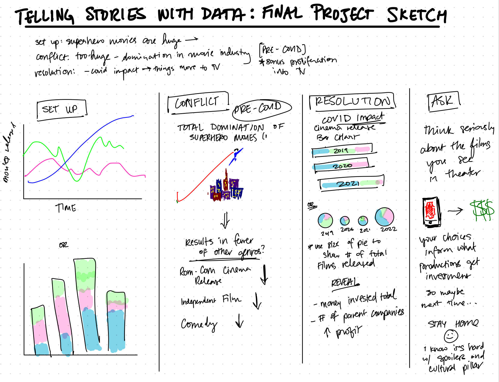

# the final project: part 1
---
# the outline.

---
# the sketches.

1. __Set Up:__ I haven't decided between proportional charts or line trends. While the line trends will show a great history of how the number of certain genre films has changed. However, the proportional chart may make a better story for showing the growing share of superhero films. 
2. __Conflict:__ I'm hoping to highlight the severe increase in superhero films with a more artistic graph that conveys the appeal of the superhero genre before sharing facts about which genres have fewer theatrical releases. In particular, I want to draw attention to the audiences who are no longer considered perhaps as demographically profitable and the cast/crew who may longer have as productive careers.
3. __Resolution:__ It is impossible to discuss the entertainment industry and theatrical release without considering COVID-19 so I do need to mention it and show its impact on the theatrical releases and what a potential return to normal looks like now. A proportional chart may be good for consistency, but because the number of films released in pandemic years were so low, it is likely better to use pie charts with the size of the circle reflecting the volume of films released to convey both absolute and relative quantities. In order to maintain my point however, I want to reveal that depsite reduced theater releases, the amount of money being invested in superhero films is very significant. 
4. __Ask:__ The ask here is somewhat simple so I want to use one more visualization to show briefly the impact of the audience's choices in something as innocuous as a movie ticket. This will support my ask to consider more deeply which films people watch in theater if they want to see more than superhero films in the future.

---
# the data.

- [Data Set 1](https://www.kaggle.com/datasets/PromptCloudHQ/imdb-data): This data set is publically accessible on Kaggle and compiled by a company called PromptCloud. It contains 1000 records of the top 100 English Language films each year from 2006 to 2016 as sourced from [IMDB](https://www.imdb.com/). The dataset contains more information than I anticipate needing, but the key measures are the film title, genres, year of release, and revenue in millions. I will be editing the genre column to indicate which movies are superhero films. For the purposes of this project, I will be using movies produced in conjunction with a comic book company (Marvel, DC, Darkhorse, etc.). 
- [Data Set 2](https://datasets.imdbws.com/): Unfortunately, the previous data set only goes through 2016. For the message I am trying to tell, which incorporates the impact of COVID-19, I need the top 100 English Language Films each year from 2017 to 2022 as well. This will add an additional 500 records to my total dataset. I will need to supplement this data myself by filtering for the appropriate measures from the original IMdB source. This data set is updated daily, but since I don't need any data from this year, it does not matter when I download it. 

---
# the method and medium.
My presentation will be shared via Shorthand. I plan to conduct any additional user research over this upcoming weekend so I have ample time for edits and possibly create additional visualizations if needed. I've designed a task list with deadlines to complete the project and be ready for presentation on February 29. 

| Task | Deadline |
| --- | --- |
| Clean Data | 02/15 | 
| Create Wire Frames | 2/17 | 
| Create Storyboards | 2/18 |
| User Research | 2/19 | 
| Edit/Update Visualizations | 2/21 | 
| Build in Shorthand | 2/25 | 
| Practice Presentation | 2/28 |
